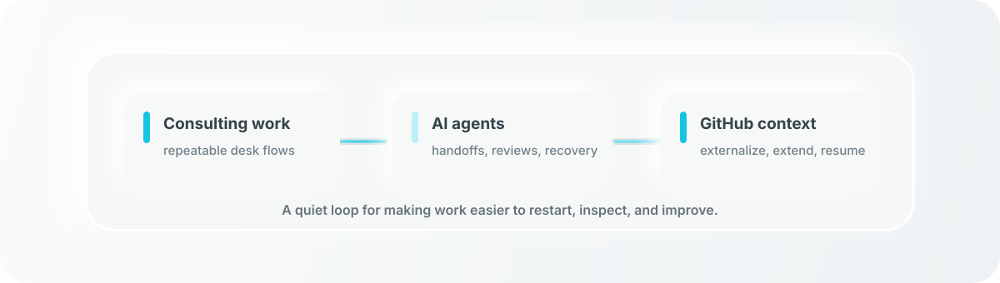

  

 

  <a href="#now-august-2026"><kbd>Now</kbd></a>
  <a href="#how-i-work"><kbd>How I work</kbd></a>
  <a href="#working-stack"><kbd>Working stack</kbd></a>
  <a href="#why-github"><kbd>Why GitHub</kbd></a>

## Reliable Human-AI Work Systems

I design practical systems for people and AI agents to work together across real desktop tools, repositories, and long-running projects. The goal is continuity: work that can be checked, recovered, handed off, and resumed.

日常業務・学習・試作を、AIと人が検証しながら継続できる仕組みに整えています。

  

## Now: August 2026

Recent work is converging around four connected themes.

| Theme | Current direction |
| --- | --- |
| Agent operations | Building bounded workflows that can pause, recover, and leave verifiable state behind |
| Context infrastructure | Keeping decisions, rules, reusable skills, and handoffs versioned across repositories and devices |
| Learning systems | Creating adaptive study loops that record answers, identify gaps, and resume from saved progress |
| Applied prototyping | Moving AI-related ideas from problem framing into requirements, external conversations, and test plans |

The larger shift is from isolated automations to a connected personal AI operating model: explicit scope, durable context, quiet execution, and evidence-backed completion.

## How I Work

- Evidence before confidence: a result should leave something inspectable behind.
- Human-owned intent: the person sets purpose and boundaries; the agent carries routine execution through to a verified result.
- Minimal ceremony, strong recovery: use the smallest process that still preserves state, rollback, and continuity.
- Quiet automation: background work should avoid interrupting the person using the machine.
- Public-safe by default: private operational context stays private; public material remains generalized and useful.

## Working Stack

`PowerShell` · `Python` · `GitHub Actions` · `Microsoft 365` · `browser automation` · `AI agents`

I use these as parts of one workflow rather than as isolated tools: automate the repeatable parts, keep decisions close to the work, and verify the saved or external state that actually matters.

## Why GitHub

Most of my working repositories are private because they contain operational context. GitHub is the synchronization, history, and recovery plane for that work: decisions, runbooks, tests, and reusable agent context live close to the projects instead of disappearing into chat history.

This profile is the public layer: a compact view of the systems and questions I am working on, without exposing private project details.
