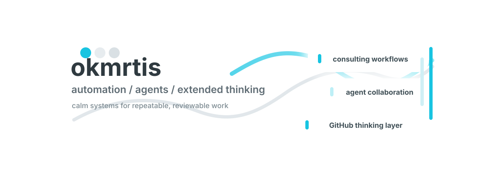

  

 

  
  
  
  

## Soft Systems Workbench

I build calm, repeatable workflows for consulting work: small automations, clear documentation, and agent-ready repositories that make thinking easier to externalize, extend, and resume.

## Focus

| Practice | What I am shaping |
| --- | --- |
| Consulting workflow automation | Turning recurring desk work into checkable, rerunnable flows |
| AI agent collaboration | Designing prompts, handoffs, reviews, and recovery paths for human-agent work |
| Externalized and extended thinking | Keeping decisions, tasks, notes, and runbooks inside versioned, reviewable repositories |
| Verification | Making outputs easier to inspect, compare, and safely continue |

## Operating Style

- Confidentiality-aware by default: public examples stay generalized and appropriate for open repositories.
- Local-first when it matters: work should remain understandable, recoverable, and easy to rerun.
- Repo-centered: decisions and procedures belong somewhere durable, not only in chat.
- Agent-aware: tasks are written so a human and an AI agent can both pick up the thread.

## Current Direction

I am exploring how consultants can combine everyday automation, AI agents, and GitHub to externalize and extend their working context: a place where ideas, decisions, and next actions become searchable, reusable, and easier to improve over time.
